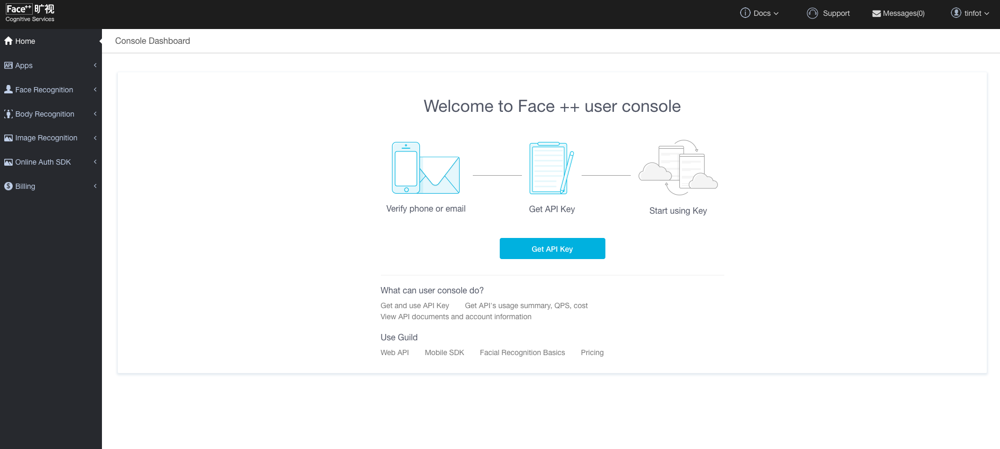

# Face plus plus SDK for Laravel 5


---

[](https://packagist.org/packages/tinfot/faceplusplus)

Need register account on the Face ++ website.
[SDK document](https://www.faceplusplus.com/), Get the `API_KEY` & `API_SECRET`.




## Installation
Require this package in your composer.json and update composer. 

```php
composer require tinfot/faceplusplus
```


## Usage

#### 1. Provider config file. `faceplusplus.php`

```bash
php artisan vendor:publish --provider="Tinfot\Faceplusplus\FaceplusplusServiceProvider" 
```

#### 2. Enter your `APPKEY` and `APPSECRET` 
```dotenv
FPP_BASE_URL=https://api-cn.faceplusplus.com # If your location in china.
# FPP_BASE_URL=https://api-us.faceplusplus.com # Or other location.

FPP_API_KEY=xxxx
FPP_API_SECRET=xxx
```

#### 3. How can I use it?

```php

use Tinfot\Faceplusplus\Facades\Faceplusplus;

// Get human body by a image(base64).
Faceplusplus::humanBodyByBase64("data:image/jpeg;base64,......");

// Get human body by a image url.
Faceplusplus::humanBodyByImageUrl("https://google.com/image.jpg");

// Human beautify
Faceplusplus::faceBeautifyByBase64("data:image/jpeg;base64,......");

// Human beautify by image url
Faceplusplus::faceBeautifyByImageUrl("https://google.com/image.jpg");

// Compare 2 image(base64). 
Faceplusplus::faceCompareByBase64("data:image/jpeg;base64,......", "data:image/jpeg;base64,......");

// Compare 2 face photo by image url.
Faceplusplus::faceCompareByImageUrl("https://google.com/image1.jpg", "https://google.com/image2.jpg");

```

## Support
Support only through Github. Please don't mail us about issues, make a Github issue instead.
